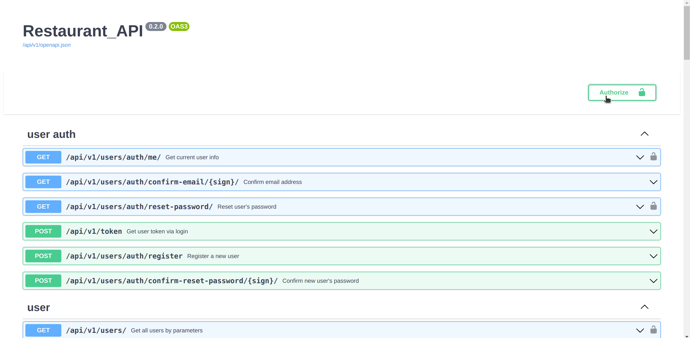
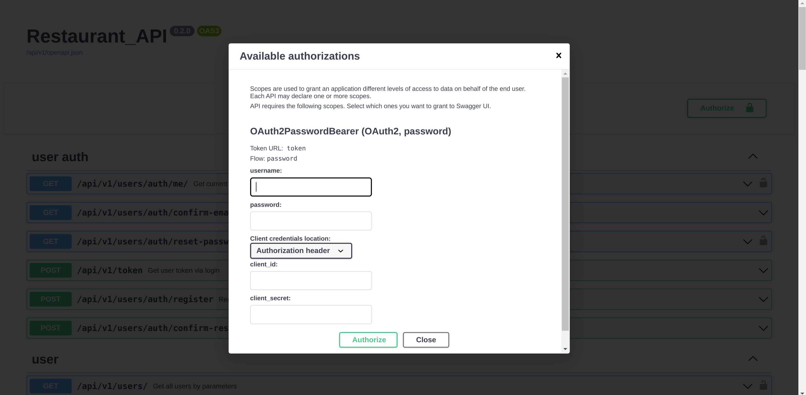

# REST-API RESTAURANT

This application is designed to manage the data of restaurant.
---
## Project stack:


- `FastAPI`
- `Pydantic`
- `SqlAlchemy`
- `Alembic`
- `Swagger`
- `Pytest`
- `PostgreSQL`
- `Redis`
- `Docker (docker-compose)`
- `Nginx`
- `Celery + Flower`
---
## Project description:
**Use PREFIX `/api/v1` before each endpoint.**
**The project have the following ENDPOINTS:**
### User auth:
<details>
<summary>User auth endpoints:</summary>

1) `GET` `/users/auth/me/` - Get current user info.
    <details>
    <summary>Description:</summary>
   
    **Returns** current user info.
    Available to all **confirmed users.**
    ```json
        {
         "username": "string",
         "email": "user@example.com",
         "phone": "505050505",
         "role": "superuser",
         "id": 0,
         "status": "confirmed"
        }
    ```
    </details>


2) `GET` `/users/auth/confirm-email/{sign}/` - Confirm email address.
    <details>
    <summary>Description:</summary>
   
    **Confirms** user's email.
    **Accessible to all.**
    `sign`: it is encoded user data, such as a username.
    ```json
    {
      "message": "E-mail has been successfully confirmed."
    }
    ```
    </details>


3) `GET` `/users/auth/reset-password/{sign}/` - Reset user's password.
    <details>
    <summary>Description:</summary>
   
    **Resets** user's password.
    Available to all **confirmed** users.
    `sign`: it is encoded user data, such as a username.
    ```json
    {
      "message": "A password reset email has been sent to your email"
    }
    ```
    </details>


4) `POST` `/token` - Get user token via login.
    <details>
    <summary>Description:</summary>
   
    **Gets** user token by entering your username and password.
    **Accessible to all.**
    ```json
    {
      "access_token": "string",
      "token_type": "string"
    }
    ```
    </details>


5) `POST` `/users/auth/register` - Register a new user.
    <details>
    <summary>Description:</summary>
   
    **Gets** new user data and saves it into db.
    **Accessible to all.**
    ```json
    {
      "username": "string",
      "email": "user@example.com",
      "phone": "661880805607310",
      "role": "superuser",
      "password": "stringst"
    }
    ```
    </details>


6) `POST` `/users/auth/confirm-reset-password/{sign}` - Confirm new user's password.
    <details>
    <summary>Description:</summary>
   
    **Gets** the user's new password and saves it in the database.
    **Accessible to all.**
    `sign`: it is encoded user data, such as a username.
    ```json
    {
      "password": "stringst",
      "password_confirm": "stringst"
    }
    ```
    </details>

</details>


### User:
<details>
<summary>User endpoints:</summary>

1) `GET` `/users/` - Get all users by parameters.
    <details>
    <summary>Description:</summary>
   
    **Returns** all users from db by parameters.
    Only available to **superuser**.

    Query params:
    - **phone**
    - **status** (`confirmed` or `unconfirmed`)

    ```json
    [
      {
        "username": "string",
        "email": "user@example.com",
        "phone": "918426795719187",
        "role": "superuser",
        "id": 0,
        "status": "confirmed"
      }
    ]
    ```
    </details>


2) `GET` `/users/{user_id}` - Get user by user id.
    <details>
    <summary>Description:</summary>
   
    **Returns** user from db by user id.
    Only available to **superuser**.

    ```json
    [
      {
        "username": "string",
        "email": "user@example.com",
        "phone": "918426795719187",
        "role": "superuser",
        "id": 0,
        "status": "confirmed"
      }
    ]
    ```
    </details>


3) `DELETE` `/users/{user_id}` - Delete user by user id.
    <details>
    <summary>Description:</summary>
   
    **Deletes** user from db by user id.
    Only available to **superuser**.

    ```json
    {
      "message": "user with id=1 was successfully deleted."
    }
    ```
    </details>


4) `PATCH` `/users/{user_id}` - Patch user by user id.
    <details>
    <summary>Description:</summary>
   
    **Updates** user from db by user id.
    Only available to **superuser**.

    ```json
    {
      "username": "some_username",
      "email": "user@example.com",
      "phone": "123456789",
      "role": "client",
      "status": "unconfirmed"
    }
    ```
    </details>


5) `POST` `/users/create` - Post user by user id.
    <details>
    <summary>Description:</summary>
   
    **Adds** new user into db.
    Only available to **superuser**.

    ```json
    {
      "username": "some_username",
      "email": "user@example.com",
      "phone": "123456789",
      "role": "client",
      "password": "some_strong_password"
    }
    ```
    </details>

</details>


### Order:
<details>
<summary>Order endpoints:</summary>

1) `GET` `/orders/` - Get all orders by parameters.
    <details>
    <summary>Description:</summary>
   
    **Returns** all orders from db by **parameters**.
    Available to all **confirmed users**.

    **Non-superuser behavior:**
    It will only find orders associated with the user id, else return empty list.

    Query params:
    - **start_datetime** (start booking date or datetime)
    - **end_datetime** (end booking date or datetime)
    - **status** (`confirmed` or `unconfirmed`)
    - **cost** (Less or equal)
    - **user_id**
    - **tables** (list of table ids)

    ```json
    [
      {
        "start_datetime": "2022-08-23T06:51",
        "end_datetime": "2022-08-23T07:51",
        "user_id": 1,
        "id": 0,
        "status": "processing",
        "cost": 0,
        "tables": [
          {
            "type": "standard",
            "number_of_seats": 1,
            "price_per_hour": 0,
            "id": 1
          }
        ]
      }
    ]
    ```
    </details>


2) `GET` `/orders/{order_id}` - Get order by order id.
    <details>
    <summary>Description:</summary>
   
    **Returns** order from db by **order id**.
    Available to all **confirmed users**.
    
    **Non-superuser behavior**:
    It will return the order only if the order is associated with this user, else return None.

    ```json
    {
      "start_datetime": "2022-08-23T06:51",
      "end_datetime": "2022-08-23T07:51",
      "user_id": 1,
      "id": 0,
      "status": "processing",
      "cost": 0,
      "tables": [
        {
          "type": "standard",
          "number_of_seats": 1,
          "price_per_hour": 0,
          "id": 1
        }
      ]
    }
    ```
    </details>


3) `DELETE` `/orders/{order_id}` - Delete order by order id.
    <details>
    <summary>Description:</summary>
   
    **Deletes** order from db by **order id**.
    Available to all **confirmed users**.
    
    **Non-superuser behavior**:
    It will delete the order only if the order is associated with this user, else raise exception that there is no such order.

    ```json
    {
      "message": "order with id=1 was successfully deleted."
    }
    ```
    </details>


4) `PATCH` `/orders/{order_id}` - Patch order by order id.
    <details>
    <summary>Description:</summary>
   
    **Updates** order from db by order id.
    Available to all **confirmed users**.
    
    **Non-superuser behavior**:
    It will patch the order only if the order is associated with this user, else raise exception that there is no such order.
    
    **Manual validations:**
    - date or datetime objects (comparison start and end values);
    - checks time range within daily schedule;
    - checks free time in the orders.
   
    ```json
    {
      "start_datetime": "2022-08-08T10:00",
      "end_datetime": "2022-08-08T12:59",
      "user_id": 1,
      "status": "confirmed",
      "cost": 5000,
      "add_tables": [
        1,
        2,
        3
      ],
      "delete_tables": [
        4
      ]
    }
    ```
    </details>


5) `POST` `/orders/create` - Add new order.
    <details>
    <summary>Description:</summary>
   
    **Adds** new order into db.
    Available to all **confirmed users**.

    **Manual validations:**
    - date or datetime objects (comparison start and end values);
    - checks time range within daily schedule;
    - checks free time in the orders.

   **Features:**
    - automatically calculates the cost of time when rounded to the nearest hour

    ```json
    {
      "start_datetime": "2022-08-10T08:00",
      "end_datetime": "2022-08-10T14:59",
      "user_id": 1,
      "tables": [
        1,
        2,
        3
      ]
    }
    ```
    </details>

</details>


### Schedule:
<details>
<summary>Schedule endpoints:</summary>

1) `GET` `/schedules/` - Get all schedules by parameters.
    <details>
    <summary>Description:</summary>
   
    **Returns** all schedules from db by **parameters**.
    Available to all **confirmed users**.

    Query params:
    - **day** (weekday or date)
    - **open_time** (More or equal)
    - **close_time** (Less or equal)
    - **break_start_time** (More or equal)
    - **break_end_time** (Less or equal)

    ```json
    [
      {
        "day": "Monday",
        "open_time": "06:00",
        "close_time": "22:00",
        "break_start_time": "13:00",
        "break_end_time": "13:59",
        "id": 0
      }
    ]
    ```
    </details>


2) `GET` `/schedules/{schedule_id}` - Get schedule by schedule id.
    <details>
    <summary>Description:</summary>
   
    **Returns** schedule from db by **schedule id**.
    Available to all **confirmed users**.

    ```json
    {
        "day": "Monday",
        "open_time": "06:00",
        "close_time": "22:00",
        "break_start_time": "13:00",
        "break_end_time": "13:59",
        "id": 0
    }
    ```
    </details>


3) `DELETE` `/schedules/{schedule_id}` - Delete order by order id.
    <details>
    <summary>Description:</summary>
   
    **Deletes** schedule from db by **schedule id**.
    Only available to **superuser or admin.**

    ```json
    {
      "message": "schedule with id=1 was successfully deleted."
    }
    ```
    </details>


4) `PATCH` `/schedules/{schedule_id}` - Patch schedule by schedule id.
    <details>
    <summary>Description:</summary>
   
    **Updates** schedule from db by **schedule id**.
    Only available to **superuser or admin.**
    
    **Manual validations:**
    - date or datetime objects (comparison open and close values);
   
    ```json
    {
      "day": "Monday",
      "open_time": "08:00",
      "close_time": "22:00",
      "break_start_time": "13:00",
      "break_end_time": "14:00"
    }
    ```
    </details>


5) `POST` `/schedules/create` - Add new schedule.
    <details>
    <summary>Description:</summary>
   
    **Adds** new schedule into db.
    Only available to **superuser or admin.**

    **Manual validations:**
    - date or datetime objects (comparison start and end values);

    ```json
    {
      "day": "2022-12-25",
      "open_time": "10:00",
      "close_time": "23:00",
      "break_start_time": "14:00",
      "break_end_time": "15:00"
    }
    ```
    </details>

</details>


### Table:
<details>
<summary>Table endpoints:</summary>

1) `GET` `/tables/` - Get all tables by parameters.
    <details>
    <summary>Description:</summary>
   
    **Returns** all tables from db by **parameters**.
    Available to all **confirmed users.**

    **Non-superuser behavior:**
    Instead of a nested full order data, it will only return the start and end datetime.

    Query params:
    - **type** (`standard`, `private`, `vip_room`)
    - **number_of_seats** (Less or equal)
    - **price_per_hour** (Less or equal)
    - **start_datetime** (Start booking date or datetime)
    - **end_datetime** (End booking date or datetime)

    ```json
    [
      {
        "type": "standard",
        "number_of_seats": 1,
        "price_per_hour": 0,
        "id": 1,
        "orders": [
          {
            "start_datetime": "2022-08-23T06:51",
            "end_datetime": "2022-08-23T07:51",
            "user_id": 1,
            "id": 1,
            "status": "processing",
            "cost": 0
          }
        ]
      }
    ]
    ```
    </details>


2) `GET` `/tables/{table_id}` - Get table by table id.
    <details>
    <summary>Description:</summary>
   
    **Returns** table from db by **table id**.
    Available to all **confirmed users.**
    
    **Non-superuser behavior:**
    Instead of a nested full order data, it will only return the start and end datetime.
    ```json
    {
      "type": "standard",
      "number_of_seats": 1,
      "price_per_hour": 0,
      "id": 1,
      "orders": [
        {
          "start_datetime": "2022-08-23T06:51",
          "end_datetime": "2022-08-23T07:51",
          "user_id": 1,
          "id": 1,
          "status": "processing",
          "cost": 0
        }
      ]
    }
    ```
    </details>


3) `DELETE` `/tables/{table_id}` - Delete table by table id.
    <details>
    <summary>Description:</summary>
   
    **Deletes** table from db by **table id**.
    Only available to **superuser or admin.**

    ```json
    {
      "message": "table with id=1 was successfully deleted."
    }
    ```
    </details>


4) `PATCH` `/tables/{table_id}` - Patch table by table id.
    <details>
    <summary>Description:</summary>
   
    **Updates** table from db by **table id**.
    Only available to **superuser or admin.**
     
    ```json
    {
      "type": "standard",
      "number_of_seats": 4,
      "price_per_hour": 5000
    }
    ```
    </details>


5) `POST` `/tables/create` - Add new table.
    <details>
    <summary>Description:</summary>
   
    **Adds** new table into db.
    Only available to **superuser or admin.**

    ```json
    {
      "type": "private",
      "number_of_seats": 2,
      "price_per_hour": 5000
    }
    ```
    </details>

</details>

---


## Installation:
First you need to create `.env` file with environment variables at the root of the project, that contains:
```
PG_SUPER_DB=superuser_database_name (by default: postgres)
PG_SUPER_USER=superuser_login (by default: postgres)
PG_SUPER_PASSWORD=superuser_password (by default: postgres)
PG_HOST=host_url (by default: localhost)
PG_PORT=postgres_port  (by default: 5432)
PG_USER_DB=your_database_name (by default: restaurant)
PG_USER=your_user_name (example: admin)
PG_USER_PASSWORD=your_user_password
INSERT_PREPARED_DATA=FALSE (`TRUE` if you want to populate the db with test or prepared data)

MAIL_USERNAME=your_email
MAIL_PASSWORD=youe_email_password
MAIL_FROM=your_email
MAIL_PORT=your_port
MAIL_SERVER=your_mail_server
MAIL_FROM_NAME=your_email

REDIS_HOST=redis (`redis` if you using docker-compose)
REDIS_PORT=6379
REDIS_PASSWORD=your_redis_password

FLOWER_USER=your_username
FLOWER_PASSWORD=your_user_password
```

### Installation via Docker-compose:

<details>
<summary>STEP 1 - Install DOCKER and DOCKER COMPOSE:</summary>

**For the beginning install `docker` and `docker compose` on your machine:**
1) **[docker](https://docs.docker.com/engine/install/ubuntu/)**
2) **[docker-compose](https://docs.docker.com/compose/install/)**
3) **P.S.: Depending on the version use:**
    ```commandline
    docker compose
    ```
   Or
    ```commandline
    docker-compose
    ```
</details>

<details>
<summary>STEP 2 - GIT clone:</summary>

1) **Then `git clone` this project in your folder.**
2) **And go to the `manage` directory where are `.sh` scripts are located.**
</details>

<details>
<summary>STEP 3 - BUILD and UP project:</summary>

**Use following command:**
- production container:
   ```commandline
   bash start.sh
   ```
- or if you want to build development container:
   ```commandline
   bash start.sh --dev
   ```
</details>

<details>
<summary>STEP 4 - Try to get DATA:</summary>

```commandline
curl http://0.0.0.0:8080/api/v1/orders/
```
After the request, you should get something like that: `{"detail":"Not authenticated"}`.
That means it's all right.

</details>

<details>
<summary>STEP 5 - Get api docs in your browser:</summary>

- **[http://0.0.0.0:8080/api/v1/docs](http://0.0.0.0:8080/api/v1/docs)**

OR

- **[http://0.0.0.0:8080/api/v1/redoc](http://0.0.0.0:8080/api/v1/redoc)**

After you got swagger docs, you can log in.



If you set `INSERT_PREPARED_DATA` to `TRUE`, just enter following data:
```
username: superuser
password: 12345678
```

</details>

<details>
<summary>STEP 6 - Run pytest:</summary>

**If you use development mode, you can run pytest:**
- First, enter to the container:
    ```commandline
    docker exec -it restaurant-backend-dev bash
    ```
- Second, run `pytest` command:
    ```bash
    cd tests/ && python -m pytest
    ```
</details>

<details>
<summary>STEP 7 - RESTART containers:</summary>

- to restart the containers:
   ```commandline
   bash restart.sh
   ```
- if you have previously run a development container:
   ```commandline
   bash restart.sh --dev
   ```
</details>

<details>
<summary>STEP 8 - STOP and REMOVE containers:</summary>

- to stop and remove the containers:
   ```commandline
   bash stop.sh
   ```
- if you have previously run a development container:
   ```commandline
   bash stop.sh --dev
   ```
</details>

<details>
<summary>STEP 9 - REMOVE all containers DATA:</summary>

- to remove all containers data:
   ```commandline
   bash remove.sh
   ```
- if you have previously run a development container:
   ```commandline
   bash remove.sh --dev
   ```
</details>

<details>
<summary>POSSIBLE ERRORS:</summary>

- **if you get `postgres` warnings after app started,
then you should probably change outer port for `postgres` in `docker-compose.yml`:**
    ```yaml
    ports:
      - '5432:5432'
    ```
   *change to ↓*
    ```yaml
    ports:
      - '5632:5432'
    ```
- **if you got something like this:**
   ```commandline
   Got permission denied while trying to connect to the Docker daemon socket at unix:///var/run/docker.sock:...
   ```
   *Use:*
   ```commandline
   sudo chmod 666 /var/run/docker.sock
   ```
- **if you use ubuntu, then you will probably have a problems with psycopg2.
So install this:**
    ```commandline
    sudo apt-get install libpq-dev
    ```
</details>

### Installation via IDE:

<details>
<summary>STEP 1 - Create env and install packages:</summary>

1) First, install **[poetry](https://python-poetry.org/docs/#installation)**:
    ```commandline
    pip install poetry
    ```
2) ```commandline
   poetry shell
   ```
3) ```commandline
   poetry install
   ```
    Or
   ```commandline
    poetry install --no-dev
   ```
</details>

<details>
<summary>STEP 2 - Start api:</summary>

**Go to the root project directory.**

`Ubuntu` (`Bash`):
```bash
python -m src.db --create_db
```
```bash
cd src/db && alembic upgrade head
```
```bash
uvicorn src.api.app:app --reload
```
</details>

<details>
<summary>STEP 3 - Get api docs:</summary>

**Get docs and data in your browser:**
```
http://localhost/api/v1
```
Or
```
http://127.0.0.1:5000/api/v1
```
Or
```
http://0.0.0.0:5000/api/v1
```
</details>

---
## Migrations:

<details>
<summary>If you begin only and have no database and have no migrations folder:</summary>

`Ubuntu` (`Bash`):
```bash
python -m src.db --create_db
```
```bash
cd src/db && alembic init migrations
```
```bash
alembic revision --autogenerate -m "first_migration"
```
```bash
alembic upgrade head
```
</details>

<details>
<summary>If you want update models only:</summary>

`Ubuntu` (`Bash`):

```bash
alembic revision --autogenerate -m "update_model"
```
```bash
alembic upgrade head
```
</details>

---
## CLI
<details>
<summary>CREATING DATABASE</summary>

**Simple command line interface, that:**

1) allows you to create db:
   ``` commandline
   python -m src.db --create_db
   ```
2) allows you to drop db:
   ``` commandline
   python -m src.db --drop_db
   ```
3) And contains optional arguments:
    - `-d`, `--db_name`, allows assign db name:
   
        ``` commandline
        python -m src.db --drop_db -d your_db_name
        ```

    - `-u`, `--user_name`, allows assign username:
   
        ``` commandline
        python -m src.db --create_db -u your_user_name
        ```
    
    - `-r`, `--role_name`, allows assign role name:
   
        ``` commandline
        python -m src.db --create_db -r your_role_name
        ```
    
    - `-p`, `--user_password`, allows assign user password:
   
        ``` commandline
        python -m src.db --create_db -p your_user_password
        ```
4) Helper:
    ``` commandline
    python -m src.db -h
    ```

**IMPORTANT:** **If the arguments is not specified, it is taken from the env variables or set by default.**
</details>

<details>
<summary>POPULATING DATABASE</summary>

1) Populate the empty database with prepared data.:
   ``` commandline
   python -m src.utils.db_populating --populate_db
   ```
2) Helper:
    ``` commandline
    python -m src.utils.db_populating -h
    ```
</details>